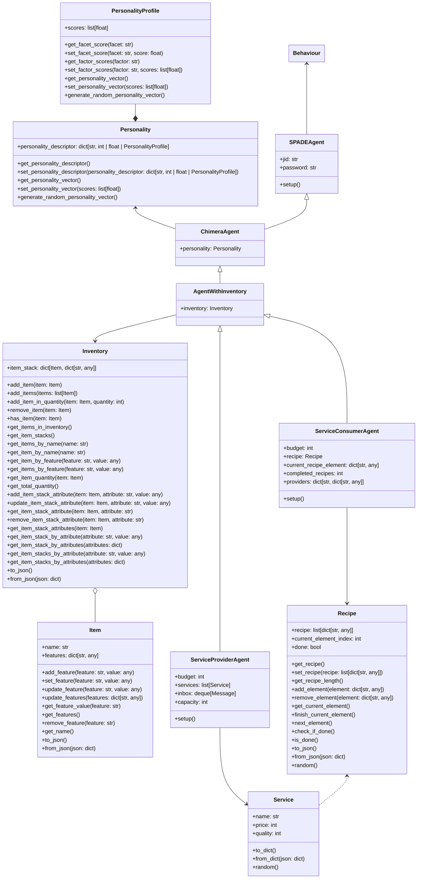
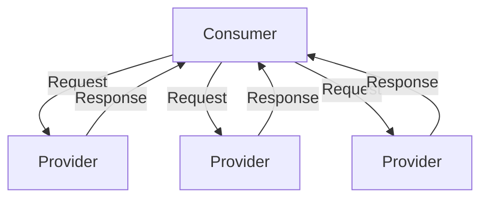
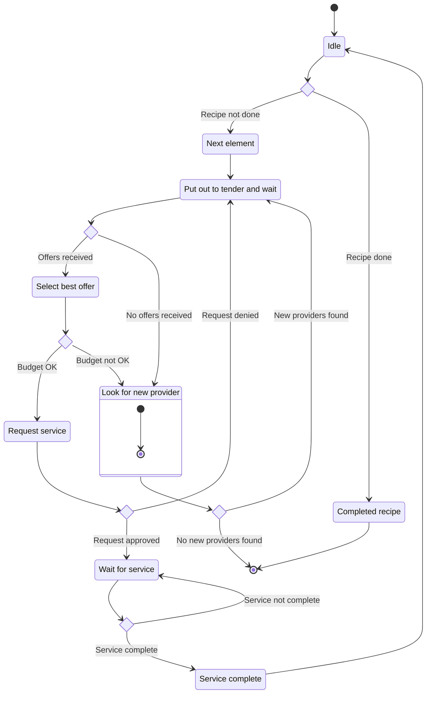
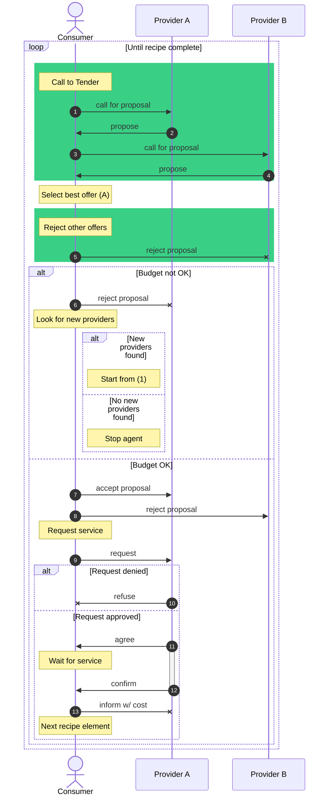
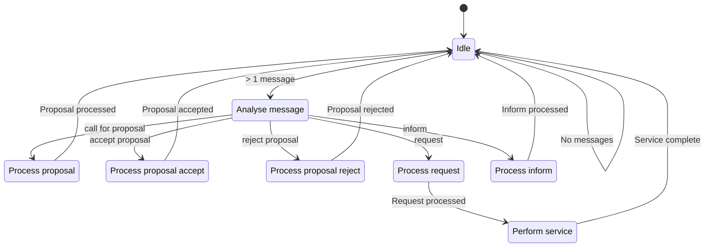

# Gamified Emergent Agent Relations (GEAR)


> *recipeWorld* is an agent-based model that simulates the emergence of networks out of a decentralized autonomous interaction. [^Fontana2015recipeWorld]

This repository contains an implementation of GEAR, a multiagent system inspired by the recipeWorld model. The implementation is based on the [SPADE](https://spade-mas.readthedocs.io/en/latest/index.html) agent implementation framework.

The basic elements of the recipeWorld model can be abstracted to the following fundamental elements of GEAR:

- **Consumers** have a *recipe* that they need to complete. The recipe is a list of *services* that need to be performed. Consumers have a *budget* that they can spend on services. Consumers can *request* services from providers.
- **Providers** offer *services* that consumers can request. Providers have a *budget* that they can spend on services. Providers can *accept* or *reject* requests from consumers. Providers can *inform* consumers when a service is complete.

One of the main goals of the original recipeWorld is to study the emergence of *networks* between consumers and providers. The network is formed by the *requests* and *inform* messages that are exchanged between consumers and providers. The network is analysed using *network analysis* techniques to study the emergence of *communities* and *hubs*. This feature is not implemented in this version of the GEAR, although agents do communicate with each other, and a log of all messages and interaction is kept.

## Install and Run

Clone the repository.

The virtual environment for running this project can easily be setup using [uv](https://github.com/astral-sh/uv). Set it up by running the following command in the root directory of the project:

```bash
uv sync
```

To run the project, use the following command:

```bash
uv run main.py
```

Agents need an XMPP server to live on and communicate with each other. SPADE offers a built-in XMPP server that can be launched by running the following command:

```bash
spade run
```

A differently-sourced local XMPP server can be used as well. For example, it can be set up using `docker` by running the following command:

```bash
docker run -d -p 5222:5222 -p 5280:5280 --name prosody -h localhost prosody/prosody
```

## Visualised GEAR Implementation Details

### Class Diagram



### Service Provider Network



### Service Consumer Finite State Machine



### Service Consumer Communication Sequence



### Service Provider Finite State Machine



[^Fontana2015recipeWorld]: Fontana, M., & Terna, P. (2015). From Agent-based models to network analysis (and return): The policy-making perspective (201507; Working Paper Series, str. 1–19). University of Turin Department of Economics and Statistics „Cognetti de Martiis“. https://ideas.repec.org/p/uto/dipeco/201507.html
